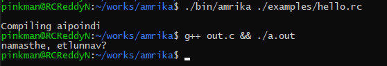

# amrika

This is named Amrika for no particular reason. You may find it crazy. Do not stop at the sight of this name. When you are done with the last sentence on this page, you might like this if you are familiar with the language Telugu. If you are foreign to it, you might want to remake this in your native tongue. Please, remember me using the words may and might. I am not promising you anything.

This is a compiler implemented in C++ for a language I cooked up. You might find the syntax and grammar familiar, may be because there are many programming languages lying around, and I might have picked up the flavours I like. Also, I put in some you don't expect. Call this an abomination, if you will. But, I call it Amrika.

The idea crept into my otherwise beautiful mind, when I came across a paper that describes a Perl module - Lingua::Romana::Perligata, that allows one to write scripts in Latin. I know people call Latin a dead language, still, I learnt a couple of sentences like 'Sum domi dormit'. Beware, you might not realise what you are getting into. The words I used for as keywords come from my personal vocabulary. You may find this project wherever, whenever, however, but do not find it funny. This is as personal as my toothbrush.

# TODO
- [x] Lexer
- [x] Parser
- [x] C Emitter
- [ ] Support for Arrays and Strings.
- [ ] Support for functions/ methods.
- [ ] Classes and Objects
- [ ] REPL

# Keywords and their English meanings

- rashey	:	Write
- chudu		:	See
- aithe		:	If
- okavela	:	In case
- ainappudu	:	While
- anuko		:	Assume
- theesko	:	Take

# Grammar

Notation is as follows:

```
::= 	refers to the definition of a rule.
|	logical OR
()	grouping
[]	zero or one repitition(s)
{}	zero or more repitition(s)
+	one or more repitition(s)
```

Keywords and operators are enclosed in double quotations.

```
program     ::=		{statement}

statement   ::=		"raayi" (expression | string) nl
		|	"chudu" comparison "aithe" nl {statement} nl "." nl
		|	"okavela" comparision "ainappudu" nl {statement} nl "." nl
		|	"anuko" ident "=" expression nl
		|	"theesko" ident nl

comparison  ::=		expression (("==" | "!=" | ">" | ">=" | "<" | "<=") expression)+

expression  ::=		term {( "-" | "+" ) term}

term	    ::=		unary {( "/" | "*") unary}

unary	    ::=		["+" | "-"] primary

primary     ::=		number | ident

nl	    ::=		'\n'+

```
			
The concocted language currently supports the following:
- Numbers that are floating point by default.
- Basic arithmetic
- chudu - aithe block which is analogous to a if block.
- anuko, and theesko statements to define variables and read data from user.
- okavela - ainappudu loop that closely resembles a while loop.
- Printing text/ numbers using rashey.
- Single line comments - anything preceded by "#".
- Read only numbers as input.

# Note
- Strings must not contain either escape characters, or "%" unna. If present an unsupported character in string error is reported.
- An identifier can only contain english alphabet. Unlike popular languages, an identifier can not contain an integer or an underscore. 
- Do not forget to end chudu-aithe and okavela-ainappudu with a DOT in the next line.
- All assignments must be preceded with "anuko".
- The current grammar and production rules are not final. I will be making changes as I see fit.


#Usage

Run the following from inside the directory.
```
./amrika ./examples/hello.rc
```
The above command takes in the file "hello.rc" and gives out an equivalent C code in the file named "out.c".

```
g++ out.c && a.out
```
Then run the above command to compile and run the C code obtained.

You must see the output on the screen.
<div align="center">
	
</div>

When you are done, run the following code to remove executables and files that are no longer necessary.
```
./clean
```

<b><p>Go through <a href="./examples/">examples</a> to get an idea of how to start coding in this language.</p>

<p>Use at your own risk. I use WSL Ubuntu on Windows 10 for development. I am not responsible for any kind of mishaps that occur to your hardware/PC when using/running Amrika.<p><b> 
